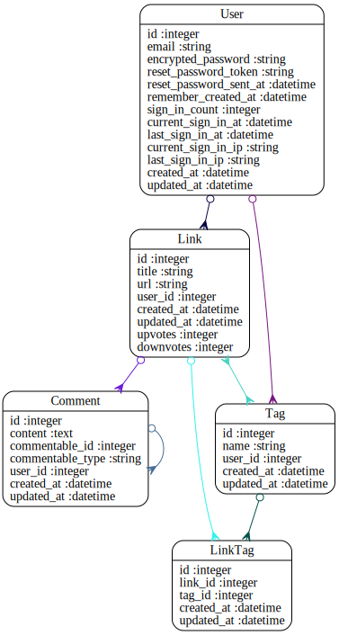

Code Review for rts
================================================
Project: linqs
================================================
#URLS

* HEROKU: __TODO__: https://XXXXX.herokuapp.com/
* GITHUB: __TODO__: https://github.com/XXXX/YYYY

# Summary

__TODO__


#Review Rubric

##Implemtation Expecations

* Models & Data Relationships
	* Expectation: At least 2 related models
	* Review: __TODO__
* Handles Invalid Data
	*  Expectation: Rails model validation for presence of necessary fields
	* Review:__TODO__
* Views & Templates	
	*  Expectation: Form partial used, but other duplication still exists
	* Review:__TODO__
* Authentication
	*  Expectation: Appropriate helper methods defined
	* Review:__TODO__
* Authorization
	* Expectation: Authorization scheme is well-thought out and used correctly.
	* Review:__TODO__
* API
	*  Expectation: An API call was made.
	* Review:__TODO__
* Testing
	*  Expectation: Includes request specs.
	* Review:__TODO__
* Heroku
	*  Expectation: Project is hosted on Heroku
	* Review:__TODO__
* JavaScript/jQuery
	* Expectation: JS/jQuery is used to handle at least one interactive event after the window loads
	* Review:__TODO__

##Code Quality Expectations

* Test Driven
	* Expectation: In addition to models, requests have been tested for valid 	responses and valid data
	* Review:__TODO__
* Flexible / extensible / scalable
	* Expectation: No database calls inside a loop
	* Review:__TODO__
* Well-commented
	* Expectation: Comments are not sporadic. Comments address the "why".
	* Review:__TODO__
* Well-formatted, Clean Project
	* Expectation: No mix of tabs and spaces
	* Review:__TODO__
* Follows naming conventions
	* Expectation: Naming follows best practices (semantic variable naming)
	* Review:__TODO__
* Secure
	* Expectation: Authorization is implemented as well as authentication.  Athorization is achieved through controller methods or helpers that limit resources
	* Review:__TODO__
* Documenting Work
	* Expectation: Public presentation of work involving key aspects of development process
	* Review:__TODO__
	


#Your Gemfile

```
source 'https://rubygems.org'


# Bundle edge Rails instead: gem 'rails', github: 'rails/rails'
gem 'rails', '4.1.1'
#debugging
gem 'pry'
#database
gem 'pg'
# Use SCSS for stylesheets
gem 'sass-rails', '~> 4.0.3'
# Use Uglifier as compressor for JavaScript assets
gem 'uglifier', '>= 1.3.0'
# Use CoffeeScript for .js.coffee assets and views
gem 'coffee-rails', '~> 4.0.0'
# See https://github.com/sstephenson/execjs#readme for more supported runtimes
# gem 'therubyracer',  platforms: :ruby

#parsing webpages
gem 'nokogiri'


# Use jquery as the JavaScript library
gem 'jquery-rails'
# Turbolinks makes following links in your web application faster. Read more: https://github.com/rails/turbolinks
gem 'turbolinks'
# Build JSON APIs with ease. Read more: https://github.com/rails/jbuilder
gem 'jbuilder', '~> 2.0'
# bundle exec rake doc:rails generates the API under doc/api.
gem 'sdoc', '~> 0.4.0',          group: :doc

# Spring speeds up development by keeping your application running in the background. Read more: https://github.com/rails/spring
gem 'spring',        group: :development

gem 'devise'
#user authentication
gem 'will_paginate', '~> 3.0'

group :production do
  gem 'rails_12factor'
end

group :development, :test do
	gem 'rspec-rails'
	gem 'factory_girl_rails'	
end

# Use ActiveModel has_secure_password
# gem 'bcrypt', '~> 3.1.7'

# Use unicorn as the app server
# gem 'unicorn'

# Use Capistrano for deployment
# gem 'capistrano-rails', group: :development

# Use debugger
# gem 'debugger', group: [:development, :test]


```


#Your Schema

```
# encoding: UTF-8
# This file is auto-generated from the current state of the database. Instead
# of editing this file, please use the migrations feature of Active Record to
# incrementally modify your database, and then regenerate this schema definition.
#
# Note that this schema.rb definition is the authoritative source for your
# database schema. If you need to create the application database on another
# system, you should be using db:schema:load, not running all the migrations
# from scratch. The latter is a flawed and unsustainable approach (the more migrations
# you'll amass, the slower it'll run and the greater likelihood for issues).
#
# It's strongly recommended that you check this file into your version control system.

ActiveRecord::Schema.define(version: 20140529211854) do

  # These are extensions that must be enabled in order to support this database
  enable_extension "plpgsql"

  create_table "comments", force: true do |t|
    t.text     "content"
    t.integer  "commentable_id"
    t.string   "commentable_type"
    t.integer  "user_id"
    t.datetime "created_at"
    t.datetime "updated_at"
  end

  add_index "comments", ["commentable_id", "commentable_type"], name: "index_comments_on_commentable_id_and_commentable_type", using: :btree

  create_table "link_tags", force: true do |t|
    t.integer  "link_id"
    t.integer  "tag_id"
    t.datetime "created_at"
    t.datetime "updated_at"
  end

  add_index "link_tags", ["link_id"], name: "index_link_tags_on_link_id", using: :btree
  add_index "link_tags", ["tag_id"], name: "index_link_tags_on_tag_id", using: :btree

  create_table "links", force: true do |t|
    t.string   "title"
    t.string   "url"
    t.integer  "user_id"
    t.datetime "created_at"
    t.datetime "updated_at"
    t.integer  "upvotes",    default: 0
    t.integer  "downvotes",  default: 0
  end

  create_table "tags", force: true do |t|
    t.string   "name"
    t.integer  "user_id"
    t.datetime "created_at"
    t.datetime "updated_at"
  end

  create_table "users", force: true do |t|
    t.string   "email",                  default: "", null: false
    t.string   "encrypted_password",     default: "", null: false
    t.string   "reset_password_token"
    t.datetime "reset_password_sent_at"
    t.datetime "remember_created_at"
    t.integer  "sign_in_count",          default: 0,  null: false
    t.datetime "current_sign_in_at"
    t.datetime "last_sign_in_at"
    t.string   "current_sign_in_ip"
    t.string   "last_sign_in_ip"
    t.datetime "created_at"
    t.datetime "updated_at"
  end

  add_index "users", ["email"], name: "index_users_on_email", unique: true, using: :btree
  add_index "users", ["reset_password_token"], name: "index_users_on_reset_password_token", unique: true, using: :btree

end

```


#Your Schema Diagram





#Your Rspec Results

```

```


#Automated Best Practices Review Results

```


Source Codes: |====================================================================|
/work/ga/wdi/2014/students/rts/db/schema.rb:19 - always add db index (comments => [user_id])
/work/ga/wdi/2014/students/rts/db/schema.rb:40 - always add db index (links => [user_id])
/work/ga/wdi/2014/students/rts/db/schema.rb:50 - always add db index (tags => [user_id])
/work/ga/wdi/2014/students/rts/app/views/comments/index.html.erb:11 - law of demeter
/work/ga/wdi/2014/students/rts/app/controllers/links_controller.rb:78 - move model logic into model (@link use_count > 4)
/work/ga/wdi/2014/students/rts/app/helpers/comments_helper.rb:1 - remove empty helpers
/work/ga/wdi/2014/students/rts/app/helpers/links_helper.rb:1 - remove empty helpers
/work/ga/wdi/2014/students/rts/app/controllers/links_controller.rb:28 - remove unused methods (LinksController#sort_by_title)
/work/ga/wdi/2014/students/rts/app/helpers/tags_helper.rb:2 - remove unused methods (TagsHelper#check_tag_owner)
/work/ga/wdi/2014/students/rts/app/models/link.rb:11 - remove unused methods (Link#keywords)
/work/ga/wdi/2014/students/rts/app/views/links/_form.html.erb:2 - replace instance variable with local variable
/work/ga/wdi/2014/students/rts/app/views/tags/_tags.html.erb:2 - replace instance variable with local variable
/work/ga/wdi/2014/students/rts/config/routes.rb:12 - restrict auto-generated routes links/comments (except: [:edit, :update, :destroy])
/work/ga/wdi/2014/students/rts/app/views/links/edit.html.erb:3 - simplify render in views
/work/ga/wdi/2014/students/rts/app/views/links/new.html.erb:2 - simplify render in views
/work/ga/wdi/2014/students/rts/app/controllers/links_controller.rb:57 - use scope access
/work/ga/wdi/2014/students/rts/app/controllers/links_controller.rb:58 - use scope access
/work/ga/wdi/2014/students/rts/app/controllers/links_controller.rb:124 - use scope access
/work/ga/wdi/2014/students/rts/app/controllers/links_controller.rb:160 - use scope access
/work/ga/wdi/2014/students/rts/app/controllers/comments_controller.rb:13 - remove trailing whitespace
/work/ga/wdi/2014/students/rts/app/controllers/links_controller.rb:90 - remove trailing whitespace
/work/ga/wdi/2014/students/rts/app/controllers/tags_controller.rb:28 - remove trailing whitespace
/work/ga/wdi/2014/students/rts/config/environments/development.rb:37 - remove trailing whitespace
/work/ga/wdi/2014/students/rts/config/routes.rb:6 - remove trailing whitespace
/work/ga/wdi/2014/students/rts/db/migrate/20140522005936_create_comments.rb:6 - remove trailing whitespace
/work/ga/wdi/2014/students/rts/app/views/layouts/application.html.erb:8 - remove trailing whitespace
/work/ga/wdi/2014/students/rts/app/views/links/_form.html.erb:9 - remove trailing whitespace
/work/ga/wdi/2014/students/rts/app/views/links/_sort.html.erb:3 - remove trailing whitespace
/work/ga/wdi/2014/students/rts/app/views/links/index.html.erb:31 - remove trailing whitespace
/work/ga/wdi/2014/students/rts/app/views/links/show.html.erb:2 - remove trailing whitespace
/work/ga/wdi/2014/students/rts/app/views/tags/index.html.erb:4 - remove trailing whitespace

Please go to http://rails-bestpractices.com to see more useful Rails Best Practices.

Found 31 warnings.

```


#Automated Code Review Results

```
Inspecting 27 files
CCWCCCCCCWCCCC.WWWCCWECCCWC

Offenses:

app/controllers/application_controller.rb:1:1: C: Missing top-level class documentation comment.
class ApplicationController < ActionController::Base
^^^^^
app/controllers/comments_controller.rb:1:1: C: Missing top-level class documentation comment.
class CommentsController < ApplicationController
^^^^^
app/controllers/comments_controller.rb:3:1: C: Use 2 (not 0) spaces for indentation.
before_filter :load_link

app/controllers/comments_controller.rb:5:3: C: Inconsistent indentation detected.
  def index  #retrieve all of the comments for the link.
  ^^^^^^^^^^^^^^^^^^^^^^^^^^^^^^^^^^^^^^^^^^^^^^^^^^^^^^
app/controllers/comments_controller.rb:5:14: C: Missing space after #.
  def index  #retrieve all of the comments for the link.
             ^^^^^^^^^^^^^^^^^^^^^^^^^^^^^^^^^^^^^^^^^^^
app/controllers/comments_controller.rb:9:3: C: Inconsistent indentation detected.
  def new  # create an empty new comment for the link that will be passed a long to the form.
  ^^^^^^^^^^^^^^^^^^^^^^^^^^^^^^^^^^^^^^^^^^^^^^^^^^^^^^^^^^^^^^^^^^^^^^^^^^^^^^^^^^^^^^^^^^^
app/controllers/comments_controller.rb:9:81: C: Line is too long. [93/80]
  def new  # create an empty new comment for the link that will be passed a long to the form.
                                                                                ^^^^^^^^^^^^^
app/controllers/comments_controller.rb:10:3: C: Use 2 (not 1) spaces for indentation.
  	@comment = @link.comments.new
  ^
app/controllers/comments_controller.rb:10:3: C: Tab detected.
  	@comment = @link.comments.new
  ^
app/controllers/comments_controller.rb:13:3: C: Inconsistent indentation detected.
  def show  
  ^^^^^^^^^^
app/controllers/comments_controller.rb:13:11: C: Trailing whitespace detected.
  def show  
          ^^
app/controllers/comments_controller.rb:14:3: C: Use 2 (not 1) spaces for indentation.
  	@comment = @link.comments.find(params[:id])
  ^
app/controllers/comments_controller.rb:14:3: C: Tab detected.
  	@comment = @link.comments.find(params[:id])
  ^
app/controllers/comments_controller.rb:17:3: C: Inconsistent indentation detected.
  def create #create a new comment for this post and call the comment_params method for the params
  ^^^^^^^^^^^^^^^^^^^^^^^^^^^^^^^^^^^^^^^^^^^^^^^^^^^^^^^^^^^^^^^^^^^^^^^^^^^^^^^^^^^^^^^^^^^^^^^^
app/controllers/comments_controller.rb:17:14: C: Missing space after #.
  def create #create a new comment for this post and call the comment_params method for the params
             ^^^^^^^^^^^^^^^^^^^^^^^^^^^^^^^^^^^^^^^^^^^^^^^^^^^^^^^^^^^^^^^^^^^^^^^^^^^^^^^^^^^^^
app/controllers/comments_controller.rb:17:81: C: Line is too long. [98/80]
  def create #create a new comment for this post and call the comment_params method for the params
                                                                                ^^^^^^^^^^^^^^^^^^
app/controllers/comments_controller.rb:18:3: C: Use 2 (not 1) spaces for indentation.
  	@comment = @link.comments.create(comment_params)
  ^
app/controllers/comments_controller.rb:18:3: C: Tab detected.
  	@comment = @link.comments.create(comment_params)
  ^
app/controllers/comments_controller.rb:19:3: C: Tab detected.
  	@comment[:user_id] = current_user.id
  ^
app/controllers/comments_controller.rb:20:3: C: Tab detected.
  	  if @comment.save # if the comment saved to the database redirect to the link's comment's index
  ^
app/controllers/comments_controller.rb:20:6: C: Use a guard clause instead of wrapping the code inside a conditional expression.
  	  if @comment.save # if the comment saved to the database redirect to the link's comment's index
     ^^
app/controllers/comments_controller.rb:20:6: C: Favor modifier if usage when having a single-line body. Another good alternative is the usage of control flow &&/||.
  	  if @comment.save # if the comment saved to the database redirect to the link's comment's index
     ^^
app/controllers/comments_controller.rb:20:6: C: Inconsistent indentation detected.
  	  if @comment.save # if the comment saved to the database redirect to the link's comment's index
     ^^^^^^^^^^^^^^^^^^^^^^^^^^^^^^^^^^^^^^^^^^^^^^^^^^^^^^^^^^^^^^^^^^^^^^^^^^^^^^^^^^^^^^^^^^^^^^
app/controllers/comments_controller.rb:20:81: C: Line is too long. [99/80]
  	  if @comment.save # if the comment saved to the database redirect to the link's comment's index
                                                                                ^^^^^^^^^^^^^^^^^^^
app/controllers/comments_controller.rb:21:3: C: Tab detected.
  	  	redirect_to link_comments_path(@link)
  ^
app/controllers/comments_controller.rb:21:6: C: Use 2 (not 1) spaces for indentation.
  	  	redirect_to link_comments_path(@link)
     ^
app/controllers/comments_controller.rb:22:3: C: Tab detected.
  	  end 
  ^
app/controllers/comments_controller.rb:22:9: C: Trailing whitespace detected.
  	  end 
        ^
app/controllers/comments_controller.rb:25:3: C: Keep a blank line before and after private.
  private 
  ^^^^^^^
app/controllers/comments_controller.rb:25:10: C: Trailing whitespace detected.
  private 
         ^
app/controllers/comments_controller.rb:26:5: C: Inconsistent indentation detected.
    def load_link
    ^^^^^^^^^^^^^
app/controllers/comments_controller.rb:27:5: C: Use 2 (not 1) spaces for indentation.
    	@link = Link.find(params[:link_id])
    ^
app/controllers/comments_controller.rb:27:5: C: Tab detected.
    	@link = Link.find(params[:link_id])
    ^
app/controllers/comments_controller.rb:30:5: C: Inconsistent indentation detected.
    def comment_params # require that the params hash contains a bid, permit the amount attribute.
    ^^^^^^^^^^^^^^^^^^^^^^^^^^^^^^^^^^^^^^^^^^^^^^^^^^^^^^^^^^^^^^^^^^^^^^^^^^^^^^^^^^^^^^^^^^^^^^
app/controllers/comments_controller.rb:30:81: C: Line is too long. [98/80]
    def comment_params # require that the params hash contains a bid, permit the amount attribute.
                                                                                ^^^^^^^^^^^^^^^^^^
app/controllers/comments_controller.rb:31:5: C: Use 2 (not 1) spaces for indentation.
    	params.require(:comment).permit(:content, :user_id)
    ^
app/controllers/comments_controller.rb:31:5: C: Tab detected.
    	params.require(:comment).permit(:content, :user_id)
    ^
app/controllers/comments_controller.rb:32:1: C: Trailing whitespace detected.
app/controllers/comments_controller.rb:32:5: C: Tab detected.
app/controllers/links_controller.rb:1:1: C: Class definition is too long. [131/100]
class LinksController < ApplicationController
^^^^^
app/controllers/links_controller.rb:1:1: C: Missing top-level class documentation comment.
class LinksController < ApplicationController
^^^^^
app/controllers/links_controller.rb:5:38: C: Use the new Ruby 1.9 hash syntax.
  before_filter :authenticate_user!, :except => [:index, :show]
                                     ^^^^^^^^^^
app/controllers/links_controller.rb:10:61: C: Prefer single-quoted strings when you don't need string interpolation or special symbols.
    links = Link.search_for(params[:q]).order(sort_column + " " + sort_direction)
                                                            ^^^
app/controllers/links_controller.rb:10:81: C: Line is too long. [81/80]
    links = Link.search_for(params[:q]).order(sort_column + " " + sort_direction)
                                                                                ^
app/controllers/links_controller.rb:12:5: C: Missing space after #.
    #allows for public and private links
    ^^^^^^^^^^^^^^^^^^^^^^^^^^^^^^^^^^^^
app/controllers/links_controller.rb:17:1: C: Extra blank line detected.
app/controllers/links_controller.rb:18:5: C: Missing space after #.
    #allows for communication with the bot
    ^^^^^^^^^^^^^^^^^^^^^^^^^^^^^^^^^^^^^^
app/controllers/links_controller.rb:21:28: C: Use the new Ruby 1.9 hash syntax.
      format.json { render :json => {:links => @link_pub.as_json}}
                           ^^^^^^^^
app/controllers/links_controller.rb:21:37: C: Space inside { missing.
      format.json { render :json => {:links => @link_pub.as_json}}
                                    ^
app/controllers/links_controller.rb:21:38: C: Use the new Ruby 1.9 hash syntax.
      format.json { render :json => {:links => @link_pub.as_json}}
                                     ^^^^^^^^^
app/controllers/links_controller.rb:21:65: C: Space inside } missing.
      format.json { render :json => {:links => @link_pub.as_json}}
                                                                ^
app/controllers/links_controller.rb:21:66: C: Space missing inside }.
      format.json { render :json => {:links => @link_pub.as_json}}
                                                                 ^
app/controllers/links_controller.rb:25:1: C: Extra blank line detected.
app/controllers/links_controller.rb:27:1: C: Incorrect indentation detected (column 0 instead of 2).
# renders json for dynamic display without reloading
^^^^^^^^^^^^^^^^^^^^^^^^^^^^^^^^^^^^^^^^^^^^^^^^^^^^
app/controllers/links_controller.rb:32:5: W: Useless assignment to variable - link_priv.
    link_priv = both.last
    ^^^^^^^^^
app/controllers/links_controller.rb:35:28: C: Use the new Ruby 1.9 hash syntax.
      format.json { render :json => {:links => link_pub.as_json}}
                           ^^^^^^^^
app/controllers/links_controller.rb:35:37: C: Space inside { missing.
      format.json { render :json => {:links => link_pub.as_json}}
                                    ^
app/controllers/links_controller.rb:35:38: C: Use the new Ruby 1.9 hash syntax.
      format.json { render :json => {:links => link_pub.as_json}}
                                     ^^^^^^^^^
app/controllers/links_controller.rb:35:64: C: Space inside } missing.
      format.json { render :json => {:links => link_pub.as_json}}
                                                               ^
app/controllers/links_controller.rb:35:65: C: Space missing inside }.
      format.json { render :json => {:links => link_pub.as_json}}
                                                                ^
app/controllers/links_controller.rb:39:1: C: Extra blank line detected.
app/controllers/links_controller.rb:40:3: C: Method has too many lines. [18/10]
  def separate_public_and_private(links)
  ^^^
app/controllers/links_controller.rb:41:5: C: Missing space after #.
    #creates an empty array for public and private links
    ^^^^^^^^^^^^^^^^^^^^^^^^^^^^^^^^^^^^^^^^^^^^^^^^^^^^
app/controllers/links_controller.rb:47:7: C: Missing space after #.
      #link_tags is the array where the tags are pushed into
      ^^^^^^^^^^^^^^^^^^^^^^^^^^^^^^^^^^^^^^^^^^^^^^^^^^^^^^
app/controllers/links_controller.rb:53:7: C: Missing space after #.
      #pushes everything that is "not private" into the array
      ^^^^^^^^^^^^^^^^^^^^^^^^^^^^^^^^^^^^^^^^^^^^^^^^^^^^^^^
app/controllers/links_controller.rb:54:30: C: Prefer single-quoted strings when you don't need string interpolation or special symbols.
      if !link_tags.include?("private")
                             ^^^^^^^^^
app/controllers/links_controller.rb:56:81: C: Line is too long. [86/80]
        # if private && the creator of link  does not equal current user - do not show
                                                                                ^^^^^^
app/controllers/links_controller.rb:57:26: C: Explicit non-nil checks are usually redundant.
      elsif current_user != nil
                         ^^
app/controllers/links_controller.rb:58:31: C: Prefer single-quoted strings when you don't need string interpolation or special symbols.
        if link_tags.include?("private") == true && link.user_id == current_user.id
                              ^^^^^^^^^
app/controllers/links_controller.rb:58:81: C: Line is too long. [83/80]
        if link_tags.include?("private") == true && link.user_id == current_user.id
                                                                                ^^^
app/controllers/links_controller.rb:65:5: C: Redundant return detected.
    return [@links, @linksprivate]
    ^^^^^^
app/controllers/links_controller.rb:68:1: C: Extra blank line detected.
app/controllers/links_controller.rb:69:1: C: Extra blank line detected.
app/controllers/links_controller.rb:77:81: C: Line is too long. [120/80]
  # sends new instance of link via ajax post to db and retrieves json for same link to display on page without reloading
                                                                                ^^^^^^^^^^^^^^^^^^^^^^^^^^^^^^^^^^^^^^^^
app/controllers/links_controller.rb:78:3: C: Method has too many lines. [26/10]
  def create
  ^^^
app/controllers/links_controller.rb:80:5: C: Use snake_case for variables.
    @potentialLink = Link.find_by(url: links_params[:url])
    ^^^^^^^^^^^^^^
app/controllers/links_controller.rb:81:81: C: Line is too long. [88/80]
    @link = current_user.links.new(title: links_params[:title], url: links_params[:url])
                                                                                ^^^^^^^^
app/controllers/links_controller.rb:83:27: C: Prefer single-quoted strings when you don't need string interpolation or special symbols.
    if @link.url.include?("http://")
                          ^^^^^^^^^
app/controllers/links_controller.rb:86:27: C: Prefer single-quoted strings when you don't need string interpolation or special symbols.
      @link.url.insert(0, "http://")
                          ^^^^^^^^^
app/controllers/links_controller.rb:90:1: C: Trailing whitespace detected.
app/controllers/links_controller.rb:92:58: C: Prefer single-quoted strings when you don't need string interpolation or special symbols.
    @inputtedtags = (links_params[:link_tags_attributes]["0"][:tag_attributes][:name]).gsub(/,/,'').downcase.split(" ").flatten
                                                         ^^^
app/controllers/links_controller.rb:92:81: C: Line is too long. [127/80]
    @inputtedtags = (links_params[:link_tags_attributes]["0"][:tag_attributes][:name]).gsub(/,/,'').downcase.split(" ").flatten
                                                                                ^^^^^^^^^^^^^^^^^^^^^^^^^^^^^^^^^^^^^^^^^^^^^^^
app/controllers/links_controller.rb:92:96: C: Space missing after comma.
    @inputtedtags = (links_params[:link_tags_attributes]["0"][:tag_attributes][:name]).gsub(/,/,'').downcase.split(" ").flatten
                                                                                               ^
app/controllers/links_controller.rb:92:116: C: Prefer single-quoted strings when you don't need string interpolation or special symbols.
    @inputtedtags = (links_params[:link_tags_attributes]["0"][:tag_attributes][:name]).gsub(/,/,'').downcase.split(" ").flatten
                                                                                                                   ^^^
app/controllers/links_controller.rb:93:1: C: Trailing whitespace detected.
app/controllers/links_controller.rb:96:7: C: Use snake_case for variables.
      potentialTag = Tag.find_by(name: tag)
      ^^^^^^^^^^^^
app/controllers/links_controller.rb:97:81: C: Line is too long. [86/80]
      # if tag is already in db, create a new association between new link and old tag
                                                                                ^^^^^^
app/controllers/links_controller.rb:99:81: C: Line is too long. [85/80]
        @link_tag = @link.link_tags.build(link_id: @link.id, tag_id: potentialTag.id)
                                                                                ^^^^^
app/controllers/links_controller.rb:103:36: C: Trailing whitespace detected.
        @link.tags.build(name: tag) 
                                   ^
app/controllers/links_controller.rb:110:30: C: Use the new Ruby 1.9 hash syntax.
        format.json { render :json => @link, :include=> :tags, status: :created}
                             ^^^^^^^^
app/controllers/links_controller.rb:110:46: C: Use the new Ruby 1.9 hash syntax.
        format.json { render :json => @link, :include=> :tags, status: :created}
                                             ^^^^^^^^^^
app/controllers/links_controller.rb:110:54: C: Surrounding space missing for operator '=>'.
        format.json { render :json => @link, :include=> :tags, status: :created}
                                                     ^^
app/controllers/links_controller.rb:110:80: C: Space missing inside }.
        format.json { render :json => @link, :include=> :tags, status: :created}
                                                                               ^
app/controllers/links_controller.rb:112:79: C: Space missing inside }.
        format.json { render json: @link.errors, status: :unprocessable_entity}
                                                                              ^
app/controllers/links_controller.rb:124:5: C: Use a guard clause instead of wrapping the code inside a conditional expression.
    if current_user && current_user.id == @link.user_id
    ^^
app/controllers/links_controller.rb:126:24: C: Prefer single-quoted strings when you don't need string interpolation or special symbols.
      flash[:notice] = "Not Authorized!"
                       ^^^^^^^^^^^^^^^^^
app/controllers/links_controller.rb:163:24: C: Prefer single-quoted strings when you don't need string interpolation or special symbols.
      flash[:notice] = "Not Authorized!"
                       ^^^^^^^^^^^^^^^^^
app/controllers/links_controller.rb:168:3: C: Keep a blank line before and after private.
  private
  ^^^^^^^
app/controllers/links_controller.rb:172:1: C: Trailing whitespace detected.
app/controllers/links_controller.rb:174:48: C: Use the new Ruby 1.9 hash syntax.
    params.require(:link).permit(:title, :url, :link_tags_attributes => [:tag_attributes =>[:name]])
                                               ^^^^^^^^^^^^^^^^^^^^^^^^
app/controllers/links_controller.rb:174:74: C: Use the new Ruby 1.9 hash syntax.
    params.require(:link).permit(:title, :url, :link_tags_attributes => [:tag_attributes =>[:name]])
                                                                         ^^^^^^^^^^^^^^^^^^
app/controllers/links_controller.rb:174:81: C: Line is too long. [100/80]
    params.require(:link).permit(:title, :url, :link_tags_attributes => [:tag_attributes =>[:name]])
                                                                                ^^^^^^^^^^^^^^^^^^^^
app/controllers/links_controller.rb:174:90: C: Surrounding space missing for operator '=>'.
    params.require(:link).permit(:title, :url, :link_tags_attributes => [:tag_attributes =>[:name]])
                                                                                         ^^
app/controllers/links_controller.rb:178:65: C: Prefer single-quoted strings when you don't need string interpolation or special symbols.
    Link.column_names.include?(params[:sort]) ? params[:sort] : "updated_at"
                                                                ^^^^^^^^^^^^
app/controllers/links_controller.rb:182:5: C: %w-literals should be delimited by ( and )
    %w[asc desc].include?(params[:direction]) ? params[:direction] : "desc"
    ^^^^^^^^^^^^
app/controllers/links_controller.rb:182:70: C: Prefer single-quoted strings when you don't need string interpolation or special symbols.
    %w[asc desc].include?(params[:direction]) ? params[:direction] : "desc"
                                                                     ^^^^^^
app/controllers/tags_controller.rb:1:1: C: Missing top-level class documentation comment.
class TagsController < ApplicationController
^^^^^
app/controllers/tags_controller.rb:9:28: C: Use the new Ruby 1.9 hash syntax.
      format.json { render :json => {:tags => @tags.as_json}}
                           ^^^^^^^^
app/controllers/tags_controller.rb:9:37: C: Space inside { missing.
      format.json { render :json => {:tags => @tags.as_json}}
                                    ^
app/controllers/tags_controller.rb:9:38: C: Use the new Ruby 1.9 hash syntax.
      format.json { render :json => {:tags => @tags.as_json}}
                                     ^^^^^^^^
app/controllers/tags_controller.rb:9:60: C: Space inside } missing.
      format.json { render :json => {:tags => @tags.as_json}}
                                                           ^
app/controllers/tags_controller.rb:9:61: C: Space missing inside }.
      format.json { render :json => {:tags => @tags.as_json}}
                                                            ^
app/controllers/tags_controller.rb:28:1: C: Trailing whitespace detected.
app/controllers/tags_controller.rb:52:5: C: Missing space after #.
    #@tag = Tag.find(params[:id])
    ^^^^^^^^^^^^^^^^^^^^^^^^^^^^^
app/controllers/tags_controller.rb:57:3: C: Keep a blank line before and after private.
  private
  ^^^^^^^
app/helpers/application_helper.rb:1:1: C: Missing top-level module documentation comment.
module ApplicationHelper
^^^^^^
app/helpers/application_helper.rb:5:60: C: Prefer single-quoted strings when you don't need string interpolation or special symbols.
    direction = column == sort_column && sort_direction == "asc" ? "desc" : "asc"
                                                           ^^^^^
app/helpers/application_helper.rb:5:68: C: Prefer single-quoted strings when you don't need string interpolation or special symbols.
    direction = column == sort_column && sort_direction == "asc" ? "desc" : "asc"
                                                                   ^^^^^^
app/helpers/application_helper.rb:5:77: C: Prefer single-quoted strings when you don't need string interpolation or special symbols.
    direction = column == sort_column && sort_direction == "asc" ? "desc" : "asc"
                                                                            ^^^^^
app/helpers/application_helper.rb:5:81: C: Line is too long. [81/80]
    direction = column == sort_column && sort_direction == "asc" ? "desc" : "asc"
                                                                                ^
app/helpers/application_helper.rb:6:33: C: Redundant curly braces around a hash parameter.
    link_to title, params.merge({:sort => column, :direction => direction}), {:class => css_class}
                                ^^^^^^^^^^^^^^^^^^^^^^^^^^^^^^^^^^^^^^^^^^
app/helpers/application_helper.rb:6:33: C: Space inside { missing.
    link_to title, params.merge({:sort => column, :direction => direction}), {:class => css_class}
                                ^
app/helpers/application_helper.rb:6:34: C: Use the new Ruby 1.9 hash syntax.
    link_to title, params.merge({:sort => column, :direction => direction}), {:class => css_class}
                                 ^^^^^^^^
app/helpers/application_helper.rb:6:51: C: Use the new Ruby 1.9 hash syntax.
    link_to title, params.merge({:sort => column, :direction => direction}), {:class => css_class}
                                                  ^^^^^^^^^^^^^
app/helpers/application_helper.rb:6:74: C: Space inside } missing.
    link_to title, params.merge({:sort => column, :direction => direction}), {:class => css_class}
                                                                         ^
app/helpers/application_helper.rb:6:78: C: Redundant curly braces around a hash parameter.
    link_to title, params.merge({:sort => column, :direction => direction}), {:class => css_class}
                                                                             ^^^^^^^^^^^^^^^^^^^^^
app/helpers/application_helper.rb:6:78: C: Space inside { missing.
    link_to title, params.merge({:sort => column, :direction => direction}), {:class => css_class}
                                                                             ^
app/helpers/application_helper.rb:6:79: C: Use the new Ruby 1.9 hash syntax.
    link_to title, params.merge({:sort => column, :direction => direction}), {:class => css_class}
                                                                              ^^^^^^^^^
app/helpers/application_helper.rb:6:81: C: Line is too long. [98/80]
    link_to title, params.merge({:sort => column, :direction => direction}), {:class => css_class}
                                                                                ^^^^^^^^^^^^^^^^^^
app/helpers/application_helper.rb:6:98: C: Space inside } missing.
    link_to title, params.merge({:sort => column, :direction => direction}), {:class => css_class}
                                                                                                 ^
app/helpers/comments_helper.rb:1:1: C: Missing top-level module documentation comment.
module CommentsHelper
^^^^^^
app/helpers/links_helper.rb:1:1: C: Missing top-level module documentation comment.
module LinksHelper
^^^^^^
app/helpers/tags_helper.rb:1:1: C: Missing top-level module documentation comment.
module TagsHelper
^^^^^^
app/helpers/tags_helper.rb:3:35: C: Use the new Ruby 1.9 hash syntax.
    tag = current_user.tags.where(:id => params[:id]).first
                                  ^^^^^^
app/helpers/tags_helper.rb:4:5: C: Use a guard clause instead of wrapping the code inside a conditional expression.
    if tag.nil?
    ^^
app/models/comment.rb:1:1: C: Missing top-level class documentation comment.
class Comment < ActiveRecord::Base
^^^^^
app/models/comment.rb:6:47: C: Space inside { missing.
  validates :content, presence: true, length: {minimum: 10}
                                              ^
app/models/comment.rb:6:59: C: Space inside } missing.
  validates :content, presence: true, length: {minimum: 10}
                                                          ^
app/models/comment.rb:7:1: C: Extra empty line detected at body end.
app/models/link.rb:1:1: C: Missing top-level class documentation comment.
class Link < ActiveRecord::Base
^^^^^
app/models/link.rb:8:45: C: Space inside { missing.
  validates :title, presence: true, length: {minimum: 2}
                                            ^
app/models/link.rb:8:56: C: Space inside } missing.
  validates :title, presence: true, length: {minimum: 2}
                                                       ^
app/models/link.rb:9:43: C: Space inside { missing.
  validates :url, presence: true, length: {minimum: 9}
                                          ^
app/models/link.rb:9:54: C: Space inside } missing.
  validates :url, presence: true, length: {minimum: 9}
                                                     ^
app/models/link.rb:12:5: C: Redundant return detected.
    return doc = Pismo::Document.new(self)
    ^^^^^^
app/models/link.rb:12:12: W: Useless assignment to variable - doc.
    return doc = Pismo::Document.new(self)
           ^^^
app/models/link.rb:17:5: C: Missing space after #.
    #how do we return what is in the tags as well
    ^^^^^^^^^^^^^^^^^^^^^^^^^^^^^^^^^^^^^^^^^^^^^
app/models/link.rb:20:3: C: Missing space after #.
  #Pagination
  ^^^^^^^^^^^
app/models/link.rb:21:3: C: Missing space after #.
  #self.per_page = 20
  ^^^^^^^^^^^^^^^^^^^
app/models/link.rb:22:1: C: Extra empty line detected at body end.
app/models/link.rb:24:1: C: 2 trailing blank lines detected.
app/models/link_tag.rb:1:1: C: Missing top-level class documentation comment.
class LinkTag < ActiveRecord::Base
^^^^^
app/models/tag.rb:1:1: C: Missing top-level class documentation comment.
class Tag < ActiveRecord::Base
^^^^^
app/models/tag.rb:5:44: C: Space inside { missing.
  validates :name, presence: true, length: {minimum: 2}
                                           ^
app/models/tag.rb:5:55: C: Space inside } missing.
  validates :name, presence: true, length: {minimum: 2}
                                                      ^
app/models/user.rb:1:1: C: Missing top-level class documentation comment.
class User < ActiveRecord::Base
^^^^^
app/models/user.rb:5:5: C: Align the elements of a hash literal if they span more than one line.
    format: { with: VALID_EMAIL_REGEX },
    ^^^^^^^^^^^^^^^^^^^^^^^^^^^^^^^^^^^
app/models/user.rb:6:5: C: Align the elements of a hash literal if they span more than one line.
    uniqueness: { case_sensitive: false }
    ^^^^^^^^^^^^^^^^^^^^^^^^^^^^^^^^^^^^^
app/models/user.rb:11:5: C: Align the parameters of a method call if they span more than one line.
    :recoverable, :rememberable, :trackable, :validatable
    ^^^^^^^^^^^^
app/workers/summarize_worker.rb:2:4: C: Final newline missing.
end
   
bin/rails:3:25: C: Prefer single-quoted strings when you don't need string interpolation or special symbols.
  load File.expand_path("../spring", __FILE__)
                        ^^^^^^^^^^^
bin/rails:4:1: W: Do not suppress exceptions.
rescue LoadError
^^^^^^^^^^^^^^^^
bin/rake:3:25: C: Prefer single-quoted strings when you don't need string interpolation or special symbols.
  load File.expand_path("../spring", __FILE__)
                        ^^^^^^^^^^^
bin/rake:4:1: W: Do not suppress exceptions.
rescue LoadError
^^^^^^^^^^^^^^^^
bin/spring:7:11: C: Prefer single-quoted strings when you don't need string interpolation or special symbols.
  require "rubygems"
          ^^^^^^^^^^
bin/spring:8:11: C: Prefer single-quoted strings when you don't need string interpolation or special symbols.
  require "bundler"
          ^^^^^^^^^
bin/spring:10:12: W: Assignment in condition - you probably meant to use ==.
  if match = Bundler.default_lockfile.read.match(/^GEM$.*?^    spring \((.*?)\)$.*?^$/m)
           ^
bin/spring:10:81: C: Line is too long. [88/80]
  if match = Bundler.default_lockfile.read.match(/^GEM$.*?^    spring \((.*?)\)$.*?^$/m)
                                                                                ^^^^^^^^
bin/spring:11:9: C: Prefer single-quoted strings when you don't need string interpolation or special symbols.
    ENV["GEM_PATH"] = ([Bundler.bundle_path.to_s] + Gem.path).join(File::PATH_SEPARATOR)
        ^^^^^^^^^^
bin/spring:11:81: C: Line is too long. [88/80]
    ENV["GEM_PATH"] = ([Bundler.bundle_path.to_s] + Gem.path).join(File::PATH_SEPARATOR)
                                                                                ^^^^^^^^
bin/spring:12:9: C: Prefer single-quoted strings when you don't need string interpolation or special symbols.
    ENV["GEM_HOME"] = ""
        ^^^^^^^^^^
bin/spring:12:23: C: Prefer single-quoted strings when you don't need string interpolation or special symbols.
    ENV["GEM_HOME"] = ""
                      ^^
bin/spring:15:9: C: Prefer single-quoted strings when you don't need string interpolation or special symbols.
    gem "spring", match[1]
        ^^^^^^^^
bin/spring:16:13: C: Prefer single-quoted strings when you don't need string interpolation or special symbols.
    require "spring/binstub"
            ^^^^^^^^^^^^^^^^
Rakefile:2:81: C: Line is too long. [90/80]
# for example lib/tasks/capistrano.rake, and they will automatically be available to Rake.
                                                                                ^^^^^^^^^^
spec/controllers/comments_controller_spec.rb:4:1: C: Use 2 (not 1) spaces for indentation.
	describe 'new comment' do
^
spec/controllers/comments_controller_spec.rb:4:1: C: Tab detected.
	describe 'new comment' do
^
spec/controllers/comments_controller_spec.rb:5:1: C: Tab detected.
		it 'should check that a user is logged in' do
^
spec/controllers/comments_controller_spec.rb:5:2: C: Use 2 (not 1) spaces for indentation.
		it 'should check that a user is logged in' do
 ^
spec/controllers/comments_controller_spec.rb:6:1: C: Tab detected.
		end
^
spec/controllers/comments_controller_spec.rb:8:1: C: Tab detected.
		it 'should associate new comments to current_user' do
^
spec/controllers/comments_controller_spec.rb:9:1: C: Tab detected.
		end
^
spec/controllers/comments_controller_spec.rb:10:1: C: Tab detected.
	end
^
spec/controllers/comments_controller_spec.rb:12:1: C: Tab detected.
	describe 'delete comment' do
^
spec/controllers/comments_controller_spec.rb:13:1: C: Tab detected.
		it 'should not allow a user to delete others comments' do
^
spec/controllers/comments_controller_spec.rb:13:2: C: Use 2 (not 1) spaces for indentation.
		it 'should not allow a user to delete others comments' do
 ^
spec/controllers/comments_controller_spec.rb:14:1: C: Tab detected.
		end
^
spec/controllers/comments_controller_spec.rb:15:1: C: Tab detected.
	end
^
spec/controllers/links_controller_spec.rb:5:3: C: Use 2 (not 1) spaces for indentation.
  	it 'renders the index view' do
  ^
spec/controllers/links_controller_spec.rb:5:3: C: Tab detected.
  	it 'renders the index view' do
  ^
spec/controllers/links_controller_spec.rb:6:3: C: Tab detected.
  		expect { User.new(id: "1", email: "rspec@test.com", password: "12345678", password_confirmation: "12345678") }
  ^
spec/controllers/links_controller_spec.rb:6:4: C: Use 2 (not 1) spaces for indentation.
  		expect { User.new(id: "1", email: "rspec@test.com", password: "12345678", password_confirmation: "12345678") }
   ^
spec/controllers/links_controller_spec.rb:6:27: C: Prefer single-quoted strings when you don't need string interpolation or special symbols.
  		expect { User.new(id: "1", email: "rspec@test.com", password: "12345678", password_confirmation: "12345678") }
                          ^^^
spec/controllers/links_controller_spec.rb:6:39: C: Prefer single-quoted strings when you don't need string interpolation or special symbols.
  		expect { User.new(id: "1", email: "rspec@test.com", password: "12345678", password_confirmation: "12345678") }
                                      ^^^^^^^^^^^^^^^^
spec/controllers/links_controller_spec.rb:6:67: C: Prefer single-quoted strings when you don't need string interpolation or special symbols.
  		expect { User.new(id: "1", email: "rspec@test.com", password: "12345678", password_confirmation: "12345678") }
                                                                  ^^^^^^^^^^
spec/controllers/links_controller_spec.rb:6:81: C: Line is too long. [114/80]
  		expect { User.new(id: "1", email: "rspec@test.com", password: "12345678", password_confirmation: "12345678") }
                                                                                ^^^^^^^^^^^^^^^^^^^^^^^^^^^^^^^^^^
spec/controllers/links_controller_spec.rb:6:102: C: Prefer single-quoted strings when you don't need string interpolation or special symbols.
  		expect { User.new(id: "1", email: "rspec@test.com", password: "12345678", password_confirmation: "12345678") }
                                                                                                     ^^^^^^^^^^
spec/controllers/links_controller_spec.rb:7:3: C: Tab detected.
  		get :index, FactoryGirl.attributes_for(:link, user: @user)
  ^
spec/controllers/links_controller_spec.rb:8:3: C: Tab detected.
  		response.should render_template :index
  ^
spec/controllers/links_controller_spec.rb:9:3: C: Tab detected.
  	end
  ^
spec/controllers/links_controller_spec.rb:13:3: C: Use 2 (not 1) spaces for indentation.
  	it 'creates new tags associated with a new link' do
  ^
spec/controllers/links_controller_spec.rb:13:3: C: Tab detected.
  	it 'creates new tags associated with a new link' do
  ^
spec/controllers/links_controller_spec.rb:14:3: C: Tab detected.
  		@link = FactoryGirl.create(:link)
  ^
spec/controllers/links_controller_spec.rb:14:5: C: Use 2 (not 0) spaces for indentation.
  		@link = FactoryGirl.create(:link)
    
spec/controllers/links_controller_spec.rb:15:3: C: Tab detected.
  		@link_tag = @link.link_tags.build
  ^
spec/controllers/links_controller_spec.rb:16:5: C: Tab detected.
    	@link_tag.build_tag
    ^
spec/controllers/links_controller_spec.rb:16:6: C: Inconsistent indentation detected.
    	@link_tag.build_tag
     ^^^^^^^^^^^^^^^^^^^
spec/controllers/links_controller_spec.rb:17:5: C: Tab detected.
    	tags = @link.tags
    ^
spec/controllers/links_controller_spec.rb:17:6: C: Inconsistent indentation detected.
    	tags = @link.tags
     ^^^^^^^^^^^^^^^^^
spec/controllers/links_controller_spec.rb:18:5: C: Tab detected.
    	tags.count.should eq(1)
    ^
spec/controllers/links_controller_spec.rb:18:6: C: Inconsistent indentation detected.
    	tags.count.should eq(1)
     ^^^^^^^^^^^^^^^^^^^^^^^
spec/controllers/links_controller_spec.rb:19:5: W: end at 19, 4 is not aligned with it 'creates new tags associated with a new link' do at 13, 3
    end
    ^^^
spec/controllers/links_controller_spec.rb:23:1: C: Tab detected.
		it 'should separate private and public links' do
^
spec/controllers/links_controller_spec.rb:23:3: C: Use 2 (not 0) spaces for indentation.
		it 'should separate private and public links' do
  
spec/controllers/links_controller_spec.rb:24:1: C: Tab detected.
			# make a private link
^
spec/controllers/links_controller_spec.rb:25:1: C: Tab detected.
			# make a public link
^
spec/controllers/links_controller_spec.rb:26:1: C: Tab detected.
			# check that they display on different parts of the page?
^
spec/controllers/links_controller_spec.rb:26:4: C: Incorrect indentation detected (column 3 instead of 4).
			# check that they display on different parts of the page?
   ^^^^^^^^^^^^^^^^^^^^^^^^^^^^^^^^^^^^^^^^^^^^^^^^^^^^^^^^^
spec/controllers/links_controller_spec.rb:27:1: C: Tab detected.
		end
^
spec/controllers/links_controller_spec.rb:29:1: C: Tab detected.
		it 'should only show private links belonging to current user' do
^
spec/controllers/links_controller_spec.rb:30:1: C: Tab detected.
			# check current user, assign it to user1
^
spec/controllers/links_controller_spec.rb:31:1: C: Tab detected.
			# make a link, assign it to user2
^
spec/controllers/links_controller_spec.rb:32:1: C: Tab detected.
			# check that link doesn't show up for user1
^
spec/controllers/links_controller_spec.rb:32:4: C: Incorrect indentation detected (column 3 instead of 4).
			# check that link doesn't show up for user1
   ^^^^^^^^^^^^^^^^^^^^^^^^^^^^^^^^^^^^^^^^^^^
spec/controllers/links_controller_spec.rb:33:1: C: Tab detected.
		end
^
spec/controllers/links_controller_spec.rb:35:1: C: Tab detected.
		it 'should require log in before creating link' do
^
spec/controllers/links_controller_spec.rb:36:1: C: Tab detected.
			# i don't know how to do this with devise
^
spec/controllers/links_controller_spec.rb:36:4: C: Incorrect indentation detected (column 3 instead of 4).
			# i don't know how to do this with devise
   ^^^^^^^^^^^^^^^^^^^^^^^^^^^^^^^^^^^^^^^^^
spec/controllers/links_controller_spec.rb:37:1: C: Tab detected.
		end
^
spec/controllers/links_controller_spec.rb:41:3: C: Use 2 (not 1) spaces for indentation.
  	it 'should order links by title' do
  ^
spec/controllers/links_controller_spec.rb:41:3: C: Tab detected.
  	it 'should order links by title' do
  ^
spec/controllers/links_controller_spec.rb:42:3: C: Tab detected.
  		linkA = Link.new(title: "A", url: "http:/www.A.com", tags: "A")
  ^
spec/controllers/links_controller_spec.rb:42:4: C: Use 2 (not 1) spaces for indentation.
  		linkA = Link.new(title: "A", url: "http:/www.A.com", tags: "A")
   ^
spec/controllers/links_controller_spec.rb:42:5: C: Use snake_case for variables.
  		linkA = Link.new(title: "A", url: "http:/www.A.com", tags: "A")
    ^^^^^
spec/controllers/links_controller_spec.rb:42:29: C: Prefer single-quoted strings when you don't need string interpolation or special symbols.
  		linkA = Link.new(title: "A", url: "http:/www.A.com", tags: "A")
                            ^^^
spec/controllers/links_controller_spec.rb:42:39: C: Prefer single-quoted strings when you don't need string interpolation or special symbols.
  		linkA = Link.new(title: "A", url: "http:/www.A.com", tags: "A")
                                      ^^^^^^^^^^^^^^^^^
spec/controllers/links_controller_spec.rb:42:64: C: Prefer single-quoted strings when you don't need string interpolation or special symbols.
  		linkA = Link.new(title: "A", url: "http:/www.A.com", tags: "A")
                                                               ^^^
spec/controllers/links_controller_spec.rb:43:3: C: Tab detected.
  		linkB = Link.new(title: "B", url: "http:/www.B.com", tags: "B")
  ^
spec/controllers/links_controller_spec.rb:43:5: W: Useless assignment to variable - linkB.
  		linkB = Link.new(title: "B", url: "http:/www.B.com", tags: "B")
    ^^^^^
spec/controllers/links_controller_spec.rb:43:5: C: Use snake_case for variables.
  		linkB = Link.new(title: "B", url: "http:/www.B.com", tags: "B")
    ^^^^^
spec/controllers/links_controller_spec.rb:43:29: C: Prefer single-quoted strings when you don't need string interpolation or special symbols.
  		linkB = Link.new(title: "B", url: "http:/www.B.com", tags: "B")
                            ^^^
spec/controllers/links_controller_spec.rb:43:39: C: Prefer single-quoted strings when you don't need string interpolation or special symbols.
  		linkB = Link.new(title: "B", url: "http:/www.B.com", tags: "B")
                                      ^^^^^^^^^^^^^^^^^
spec/controllers/links_controller_spec.rb:43:64: C: Prefer single-quoted strings when you don't need string interpolation or special symbols.
  		linkB = Link.new(title: "B", url: "http:/www.B.com", tags: "B")
                                                               ^^^
spec/controllers/links_controller_spec.rb:44:3: C: Tab detected.
  		linkC = Link.new(title: "C", url: "http:/www.C.com", tags: "C")
  ^
spec/controllers/links_controller_spec.rb:44:5: W: Useless assignment to variable - linkC.
  		linkC = Link.new(title: "C", url: "http:/www.C.com", tags: "C")
    ^^^^^
spec/controllers/links_controller_spec.rb:44:5: C: Use snake_case for variables.
  		linkC = Link.new(title: "C", url: "http:/www.C.com", tags: "C")
    ^^^^^
spec/controllers/links_controller_spec.rb:44:29: C: Prefer single-quoted strings when you don't need string interpolation or special symbols.
  		linkC = Link.new(title: "C", url: "http:/www.C.com", tags: "C")
                            ^^^
spec/controllers/links_controller_spec.rb:44:39: C: Prefer single-quoted strings when you don't need string interpolation or special symbols.
  		linkC = Link.new(title: "C", url: "http:/www.C.com", tags: "C")
                                      ^^^^^^^^^^^^^^^^^
spec/controllers/links_controller_spec.rb:44:64: C: Prefer single-quoted strings when you don't need string interpolation or special symbols.
  		linkC = Link.new(title: "C", url: "http:/www.C.com", tags: "C")
                                                               ^^^
spec/controllers/links_controller_spec.rb:45:3: C: Tab detected.
  		links = Link.all.order(:title)
  ^
spec/controllers/links_controller_spec.rb:46:3: C: Tab detected.
  		links.first.should eq(linkA)
  ^
spec/controllers/links_controller_spec.rb:47:3: C: Tab detected.
  	end
  ^
spec/controllers/links_controller_spec.rb:51:3: C: Use 2 (not 1) spaces for indentation.
  	it 'should increase the link\'s votes' do
  ^
spec/controllers/links_controller_spec.rb:51:3: C: Tab detected.
  	it 'should increase the link\'s votes' do
  ^
spec/controllers/links_controller_spec.rb:52:3: C: Tab detected.
  		# link1 = Link.new
  ^
spec/controllers/links_controller_spec.rb:53:3: C: Tab detected.
  		# link1.upvotes = 1
  ^
spec/controllers/links_controller_spec.rb:54:3: C: Tab detected.
  		# link2 = Link.new
  ^
spec/controllers/links_controller_spec.rb:55:3: C: Tab detected.
  		# link2.upvotes = 2
  ^
spec/controllers/links_controller_spec.rb:56:3: C: Tab detected.
  		# @links = Link.all
  ^
spec/controllers/links_controller_spec.rb:56:5: C: Incorrect indentation detected (column 4 instead of 5).
  		# @links = Link.all
    ^^^^^^^^^^^^^^^^^^^
spec/controllers/links_controller_spec.rb:57:3: C: Tab detected.
  	end
  ^
spec/controllers/links_controller_spec.rb:60:1: C: Extra blank line detected.
spec/controllers/links_controller_spec.rb:61:1: C: Extra blank line detected.
spec/controllers/tags_controller_spec.rb:39:1: E: unexpected token $end
spec/factories/factories.rb:9:14: C: Prefer single-quoted strings when you don't need string interpolation or special symbols.
    password "password"
             ^^^^^^^^^^
spec/factories/factories.rb:10:27: C: Prefer single-quoted strings when you don't need string interpolation or special symbols.
    password_confirmation "password"
                          ^^^^^^^^^^
spec/factories/factories.rb:14:11: C: Prefer single-quoted strings when you don't need string interpolation or special symbols.
    title "Best Link Ever"
          ^^^^^^^^^^^^^^^^
spec/factories/factories.rb:15:9: C: Prefer single-quoted strings when you don't need string interpolation or special symbols.
    url "https://www.google.com"
        ^^^^^^^^^^^^^^^^^^^^^^^^
spec/factories/factories.rb:16:9: C: Prefer single-quoted strings when you don't need string interpolation or special symbols.
    tag ""
        ^^
spec/factories/factories.rb:21:10: C: Prefer single-quoted strings when you don't need string interpolation or special symbols.
    name "sampletag"
         ^^^^^^^^^^^
spec/factories/factories.rb:24:4: C: Final newline missing.
end
   
spec/models/link_spec.rb:3:1: C: Extra blank line detected.
spec/models/link_spec.rb:5:1: C: Use 2 (not 1) spaces for indentation.
	subject { FactoryGirl.create(:link) }
^
spec/models/link_spec.rb:5:1: C: Tab detected.
	subject { FactoryGirl.create(:link) }
^
spec/models/link_spec.rb:7:3: C: Inconsistent indentation detected.
  describe 'title' do
  ^^^^^^^^^^^^^^^^^^^
spec/models/link_spec.rb:8:3: C: Use 2 (not 1) spaces for indentation.
  	it 'should have a title' do
  ^
spec/models/link_spec.rb:8:3: C: Tab detected.
  	it 'should have a title' do
  ^
spec/models/link_spec.rb:9:3: C: Tab detected.
  		subject.should be_valid
  ^
spec/models/link_spec.rb:9:4: C: Use 2 (not 1) spaces for indentation.
  		subject.should be_valid
   ^
spec/models/link_spec.rb:10:3: C: Tab detected.
  	end
  ^
spec/models/link_spec.rb:12:3: C: Tab detected.
  	it 'should have a minimum of 2 characters' do
  ^
spec/models/link_spec.rb:13:3: C: Tab detected.
  		subject.should be_valid
  ^
spec/models/link_spec.rb:13:4: C: Use 2 (not 1) spaces for indentation.
  		subject.should be_valid
   ^
spec/models/link_spec.rb:14:3: C: Tab detected.
  	end
  ^
spec/models/link_spec.rb:17:3: C: Inconsistent indentation detected.
  describe 'url' do
  ^^^^^^^^^^^^^^^^^
spec/models/link_spec.rb:18:3: C: Use 2 (not 1) spaces for indentation.
  	it 'should have a url' do
  ^
spec/models/link_spec.rb:18:3: C: Tab detected.
  	it 'should have a url' do
  ^
spec/models/link_spec.rb:19:3: C: Tab detected.
  		subject.should be_valid
  ^
spec/models/link_spec.rb:19:4: C: Use 2 (not 1) spaces for indentation.
  		subject.should be_valid
   ^
spec/models/link_spec.rb:20:3: C: Tab detected.
  	end
  ^
spec/models/link_spec.rb:22:3: C: Tab detected.
  	it 'should have a minimum of 5 characters' do
  ^
spec/models/link_spec.rb:23:3: C: Tab detected.
  		subject.should be_valid
  ^
spec/models/link_spec.rb:23:4: C: Use 2 (not 1) spaces for indentation.
  		subject.should be_valid
   ^
spec/models/link_spec.rb:24:3: C: Tab detected.
  	end
  ^
spec/models/link_spec.rb:27:1: C: Incorrect indentation detected (column 0 instead of 2).
# We currently don't have any user-link association. Need to add?
^^^^^^^^^^^^^^^^^^^^^^^^^^^^^^^^^^^^^^^^^^^^^^^^^^^^^^^^^^^^^^^^^
spec/models/tag_spec.rb:4:1: C: Use 2 (not 1) spaces for indentation.
	subject { FactoryGirl.create(:tag) }
^
spec/models/tag_spec.rb:4:1: C: Tab detected.
	subject { FactoryGirl.create(:tag) }
^
spec/models/tag_spec.rb:6:3: C: Inconsistent indentation detected.
  describe 'name' do
  ^^^^^^^^^^^^^^^^^^
spec/models/tag_spec.rb:7:3: C: Use 2 (not 1) spaces for indentation.
  	it 'should have a tag name' do
  ^
spec/models/tag_spec.rb:7:3: C: Tab detected.
  	it 'should have a tag name' do
  ^
spec/models/tag_spec.rb:8:3: C: Tab detected.
  		subject.should be_valid
  ^
spec/models/tag_spec.rb:8:4: C: Use 2 (not 1) spaces for indentation.
  		subject.should be_valid
   ^
spec/models/tag_spec.rb:9:3: C: Tab detected.
  	end
  ^
spec/models/user_spec.rb:7:3: C: Use 2 (not 1) spaces for indentation.
  	it 'should have an email address' do
  ^
spec/models/user_spec.rb:7:3: C: Tab detected.
  	it 'should have an email address' do
  ^
spec/models/user_spec.rb:8:3: C: Tab detected.
  		subject.should be_valid
  ^
spec/models/user_spec.rb:8:4: C: Use 2 (not 1) spaces for indentation.
  		subject.should be_valid
   ^
spec/models/user_spec.rb:9:3: C: Tab detected.
  	end
  ^
spec/models/user_spec.rb:11:3: C: Tab detected.
  	it 'should be in email format' do
  ^
spec/models/user_spec.rb:12:3: C: Tab detected.
  		subject.email = "fake_email.com"
  ^
spec/models/user_spec.rb:12:4: C: Use 2 (not 1) spaces for indentation.
  		subject.email = "fake_email.com"
   ^
spec/models/user_spec.rb:12:21: C: Prefer single-quoted strings when you don't need string interpolation or special symbols.
  		subject.email = "fake_email.com"
                    ^^^^^^^^^^^^^^^^
spec/models/user_spec.rb:13:7: C: Inconsistent indentation detected.
      subject.should_not be_valid
      ^^^^^^^^^^^^^^^^^^^^^^^^^^^
spec/models/user_spec.rb:14:3: C: Tab detected.
  	end
  ^
spec/models/user_spec.rb:16:3: C: Tab detected.
  	it 'should be unique' do
  ^
spec/models/user_spec.rb:17:3: C: Tab detected.
  		user1 = User.create(email: "user1@email.com", password: "12345678", password_confirmation: "12345678")
  ^
spec/models/user_spec.rb:17:4: C: Use 2 (not 1) spaces for indentation.
  		user1 = User.create(email: "user1@email.com", password: "12345678", password_confirmation: "12345678")
   ^
spec/models/user_spec.rb:17:5: W: Useless assignment to variable - user1.
  		user1 = User.create(email: "user1@email.com", password: "12345678", password_confirmation: "12345678")
    ^^^^^
spec/models/user_spec.rb:17:32: C: Prefer single-quoted strings when you don't need string interpolation or special symbols.
  		user1 = User.create(email: "user1@email.com", password: "12345678", password_confirmation: "12345678")
                               ^^^^^^^^^^^^^^^^^
spec/models/user_spec.rb:17:61: C: Prefer single-quoted strings when you don't need string interpolation or special symbols.
  		user1 = User.create(email: "user1@email.com", password: "12345678", password_confirmation: "12345678")
                                                            ^^^^^^^^^^
spec/models/user_spec.rb:17:81: C: Line is too long. [106/80]
  		user1 = User.create(email: "user1@email.com", password: "12345678", password_confirmation: "12345678")
                                                                                ^^^^^^^^^^^^^^^^^^^^^^^^^^
spec/models/user_spec.rb:17:96: C: Prefer single-quoted strings when you don't need string interpolation or special symbols.
  		user1 = User.create(email: "user1@email.com", password: "12345678", password_confirmation: "12345678")
                                                                                               ^^^^^^^^^^
spec/models/user_spec.rb:18:3: C: Tab detected.
  		user2 = User.create(email: "user1@email.com", password: "12345678", password_confirmation: "12345678")
  ^
spec/models/user_spec.rb:18:32: C: Prefer single-quoted strings when you don't need string interpolation or special symbols.
  		user2 = User.create(email: "user1@email.com", password: "12345678", password_confirmation: "12345678")
                               ^^^^^^^^^^^^^^^^^
spec/models/user_spec.rb:18:61: C: Prefer single-quoted strings when you don't need string interpolation or special symbols.
  		user2 = User.create(email: "user1@email.com", password: "12345678", password_confirmation: "12345678")
                                                            ^^^^^^^^^^
spec/models/user_spec.rb:18:81: C: Line is too long. [106/80]
  		user2 = User.create(email: "user1@email.com", password: "12345678", password_confirmation: "12345678")
                                                                                ^^^^^^^^^^^^^^^^^^^^^^^^^^
spec/models/user_spec.rb:18:96: C: Prefer single-quoted strings when you don't need string interpolation or special symbols.
  		user2 = User.create(email: "user1@email.com", password: "12345678", password_confirmation: "12345678")
                                                                                               ^^^^^^^^^^
spec/models/user_spec.rb:19:3: C: Tab detected.
  		user2.should_not be_valid
  ^
spec/models/user_spec.rb:20:3: C: Tab detected.
  	end
  ^
spec/spec_helper.rb:2:5: C: Prefer single-quoted strings when you don't need string interpolation or special symbols.
ENV["RAILS_ENV"] ||= 'test'
    ^^^^^^^^^^^
spec/spec_helper.rb:3:26: C: Prefer single-quoted strings when you don't need string interpolation or special symbols.
require File.expand_path("../../config/environment", __FILE__)
                         ^^^^^^^^^^^^^^^^^^^^^^^^^^
spec/spec_helper.rb:9:21: C: Prefer single-quoted strings when you don't need string interpolation or special symbols.
Dir[Rails.root.join("spec/support/**/*.rb")].each { |f| require f }
                    ^^^^^^^^^^^^^^^^^^^^^^
spec/spec_helper.rb:41:18: C: Prefer single-quoted strings when you don't need string interpolation or special symbols.
  config.order = "random"
                 ^^^^^^^^

27 files inspected, 333 offenses detected

```

